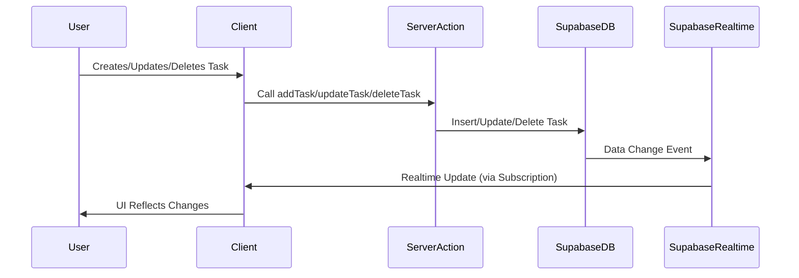
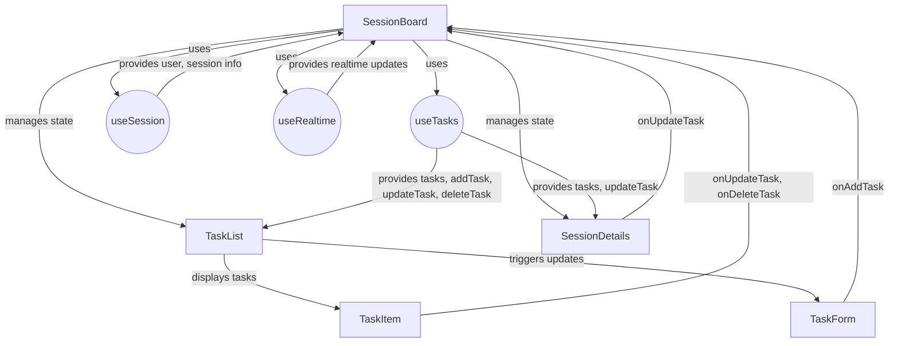

# ⚠️ DEPRECATED - Architecture Overview

> **STATUS:** OUTDATED - This document was written in August 2025 and describes the initial architecture.  
> **REASON:** Mock data fallback has been removed; OAuth has been replaced with animal code authentication.  
> **SEE INSTEAD:** Current codebase for actual implementation.  
> **LAST UPDATED:** 2025-08-15

**Date:** 2025-08-15
**Author:** Gemini

This document provides an overview of the architecture for Erin's Escapades, detailing the client-side, server-side, and database components, along with their interactions.

## 1. High-Level Architecture

Erin's Escapades is a Next.js application that leverages server actions for backend interactions and Supabase as its primary backend-as-a-service (BaaS). During development, a mock fallback is provided to allow for client-side development without a live Supabase instance.

```mermaid
graph TD
    A[Client - Next.js/React] -->|User Interaction| B(Server Actions)
    B -->|Data Operations| C(Supabase - Auth, DB, Realtime)
    B -->|Fallback (Dev)| D(Mock Data)
    C -->|Realtime Updates| A
    D -->|Mock Data Access| A
```

## 2. Component Breakdown

### Client-Side (Next.js/React)

-   **Next.js:** Provides the framework for server-side rendering (SSR), static site generation (SSG), and API routes.
-   **React:** Used for building the user interface components.
-   **Framer Motion:** For animations and transitions.
-   **Tailwind CSS:** For styling.
-   **Hooks (`useSession`, `useTasks`, `useRealtime`):** Custom React hooks to manage application state and interact with the backend (either Supabase or mock data).

### Server-Side (Next.js Server Actions)

-   **Server Actions:** Next.js 14 feature used for direct server-side data mutations and authentication logic. This reduces the need for explicit API routes for simple CRUD operations.
-   **Supabase Client (Server-side):** Used within server actions to interact with the Supabase database and authentication services.

### Backend-as-a-Service (Supabase)

-   **Supabase Auth:** Handles user authentication (email/password, OAuth) and session management.
-   **Supabase Database (PostgreSQL):** Stores application data (users, sessions, tasks). Row-Level Security (RLS) is applied to ensure data security.
-   **Supabase Realtime:** Provides real-time updates to connected clients when data in the database changes, enabling collaborative features.

### Mock Fallback

-   **`lib/mock-data.ts`:** Provides in-memory mock data for development and testing purposes when Supabase environment variables are not configured. This allows for rapid UI development without requiring a live backend.

## 3. Key Interactions

### Task CRUD + Realtime Flow



### SessionBoard and TaskList Interactions


